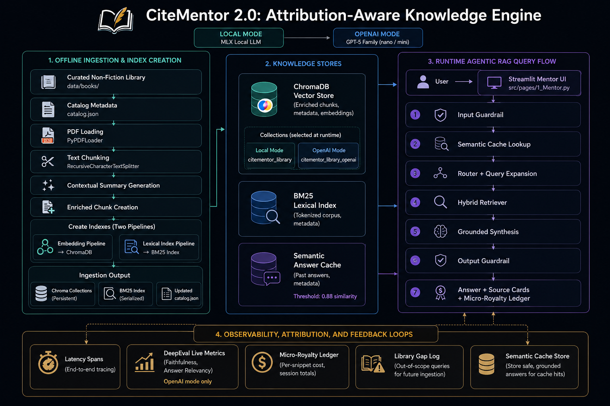

# CiteMentor 2.0 | The Attribution-Aware Knowledge Engine

### *Pay only for the wisdom you use.*

[](https://agentic-rag-citementor2.streamlit.app/) 

## Executive Overview

**CiteMentor** is a specialized GenAI platform that transforms static non-fiction libraries into interactive, actionable mentorship. Unlike generic Large Language Models (LLMs) that provide broad, opaque answers, this system utilizes a curated knowledge base of trusted authors to provide grounded advice.

**The Differentiator:** This project introduces a novel economic framework for AI: a **Micro-Royalty System**. It tracks exactly which content is used to generate an answer (down to the paragraph), paving the way for fair author compensation in the age of AI.

---

## The Problem Statement

Current information consumption models are broken for both consumers and creators:

1.  **The "Implementation Gap" (Readers):** People seek advice from books but struggle with volume. Attention spans are shortening; users want solutions, not just 300 pages of text.
2.  **The "Hallucination Risk" (Generic AI):** Public LLMs often generate convincing but generic or factually incorrect advice. They lack a verifiable "source of truth."
3.  **The "Black Box" Issue (Authors):** Intellectual property is currently used to train models without consent or compensation. There is no clear mechanism to attribute a specific AI answer to a specific author's work.

## The Solution

An AI-assisted "Mentor" that sits on top of a curated library of high-quality non-fiction.

* **Context-Aware Advisory:** Users ask life/career questions (e.g., *"How do I handle a toxic boss?"*). The system retrieves specific strategies from verified experts.
* **Verifiable Trust:** Every answer is accompanied by a **"Source Card"** displaying the exact book, author, and snippet used.
* **The "Fair-Use" Ledger:** A built-in accounting mechanism that calculates cost per query based on the specific chunks retrieved.

| Feature | Benefit to User | Benefit to Ecosystem |
| :--- | :--- | :--- |
| **Curated RAG** | High-quality, specific advice. No hallucinations. | Eliminates "noise" from internet-scraped data. |
| **Citation Engine** | Trust and transparency. You see the evidence. | Drives discovery of original books. |
| **Royalty Logic** | Users pay fractions of a cent per answer. | Solves the ethical dilemma of AI vs. Copyright. |


This is version 2 of the project. Version 1 proved the core idea with a small
three-book public-domain demo. Version 2 turns it into a fuller applied AI
engineering portfolio project with local ingestion, LangGraph orchestration,
hybrid retrieval, guardrails, evals, observability, and deployment-friendly
OpenAI inference mode.

## Architecture



## Core Features

- **Agentic RAG workflow:** LangGraph coordinates guardrails, combined routing
  plus query expansion, retrieval, optional reranking, and grounded synthesis.
- **Hybrid retrieval:** Combines vector search, BM25 lexical search, reciprocal
  rank fusion, and reranking.
- **Source cards:** Every standard answer displays the retrieved book snippets
  used as evidence.
- **Micro-royalty ledger:** Each retrieved snippet contributes a fractional
  cost based on book price and total chunk count.
- **Observability dashboard:** Tracks live DeepEval scores, per-node latency
  spans, semantic cache hits, and out-of-scope queries as library gaps.
- **Local-first mode:** Runs routing, synthesis, embeddings, and reranking
  locally with MLX and local rerankers.
- **OpenAI demo mode:** Uses OpenAI API models for combined routing/expansion,
  synthesis, and optional evals while skipping the LLM reranker by default for
  hosted demo latency.

## Version 1 to Version 2

| Area | Version 1 | Version 2 |
| --- | --- | --- |
| Scope | Core RAG proof of concept | End-to-end portfolio system |
| Library | Three public-domain books | Expandable curated catalog |
| Ingestion | Vector DB created externally on Colab | Local ingestion on Apple Silicon |
| Orchestration | Basic retrieval flow | LangGraph agent workflow |
| Retrieval | Core semantic search | Hybrid vector + BM25 + RRF + reranking |
| Safety | Minimal | Input and output guardrails |
| Observability | Minimal | Dashboard, DeepEval evals, latency spans, cache hits, gap logging |
| Attribution | Source display | Source display plus micro-royalty ledger |
| Deployment | Demo-focused | Local mode plus OpenAI API mode |


## Inference Modes

The main switch lives in `config/retrieval.yaml`:

```yaml
system:
  inference_mode: "local" # or "openai"
```

### Local mode

Use this mode when developing on a capable Apple Silicon machine.

- Router and synthesis use the configured MLX local LLM.
- Chroma queries use the local embedding model that matches ingestion.
- Reranking uses the local cross-encoder.
- No OpenAI API call is required for core answering.
- Live DeepEval evals are disabled in the UI so local mode remains fully local.

### OpenAI mode

Use this mode for Streamlit deployment or fast demos.

- Combined routing and query expansion use `openai.router_model`.
- Reranking uses reciprocal-rank-fused retrieval by default; set
  `openai.use_llm_reranker: true` to use `openai.reranker_model`.
- Final answer synthesis uses `openai.synthesis_model`.
- DeepEval evals use `openai.eval_model`.
- Local embedding and local cross-encoder models are not loaded.
- Semantic search uses the `citementor_library_openai` Chroma collection,
  which is embedded with `openai.embedding_model`.

The default OpenAI choices are optimized for demo latency:

```yaml
openai:
  router_model: "gpt-5-nano"
  reranker_model: "gpt-5-nano"
  use_llm_reranker: false
  synthesis_model: "gpt-5-mini"
  eval_model: "gpt-5-mini"
```

## Tech Stack

- **UI:** Streamlit
- **Workflow orchestration:** LangGraph
- **LLM framework:** LangChain
- **Vector database:** ChromaDB
- **Lexical retrieval:** BM25
- **Local inference:** MLX LM
- **Local embeddings:** `nomic-ai/nomic-embed-text-v1.5`
- **Local reranking:** `cross-encoder/ms-marco-MiniLM-L-6-v2`
- **OpenAI models:** Configurable GPT-5 family models and
  `text-embedding-3-small`
- **Evaluation:** DeepEval

## Project Structure

```text
.
├── config/
│   └── retrieval.yaml          # Retrieval and model configuration
├── src/
│   ├── app.py                  # Streamlit navigation entrypoint
│   ├── core/
│   │   ├── graph.py            # LangGraph workflow
│   │   ├── guardrails.py       # Input and output safety checks
│   │   ├── ledger.py           # Micro-royalty accounting
│   │   ├── semantic_cache.py   # Persistent semantic answer cache
│   │   └── retriever.py        # Hybrid retrieval and reranking
│   ├── pages/
│   │   ├── 1_Mentor.py         # Chat interface
│   │   ├── 2_Dashboard.py      # evaluation, latency, and gap observability
│   │   ├── 3_Ledger.py         # Royalty ledger page
│   │   └── 4_About.py          # Portfolio project overview
│   └── utils/
│       └── ingestion.py        # Local ingestion pipeline
├── storage/
│   ├── chroma_db/              # Persistent Chroma database
│   └── bm25/                   # Serialized BM25 index
├── catalog.json                # Book metadata and pricing inputs
├── prompts.yaml                # Router, expansion, and synthesis prompts
├── pyproject.toml              # Python dependencies
└── README.md
```

## Setup

Install dependencies with `uv`:

```bash
uv sync
```

Create a `.env` file if you plan to use OpenAI mode or live DeepEval evals:

```bash
OPENAI_API_KEY=sk-proj-...
```

Run the app:

```bash
uv run streamlit run src/app.py
```

Open the local Streamlit URL printed in the terminal, usually:

```text
http://localhost:8501
```

## Ingestion

Place PDFs in `data/books/` and ensure `catalog.json` contains matching
metadata.

For local ingestion from PDFs, run:

```bash
uv run python -m src.utils.ingestion
```

For OpenAI demo/deployment mode, rebuild the OpenAI vector collection from the
already enriched local Chroma documents:

```bash
uv run python -m src.utils.ingestion --profile openai --reset
```

This creates or refreshes `citementor_library_openai` using
`text-embedding-3-small` while preserving the contextual chunk text generated by
the local ingestion pipeline. It is much faster and cheaper than asking an LLM
to regenerate summaries for every chunk.

If you explicitly want to regenerate contextual summaries through OpenAI as
well, use:

```bash
uv run python -m src.utils.ingestion --profile openai --source pdf --reset
```

That path is slower because it calls an OpenAI chat model for contextual
summaries before embedding.

The local PDF ingestion pipeline:

1. Loads PDFs.
2. Splits documents into overlapping chunks.
3. Uses a local MLX model to generate contextual summaries.
4. Prepends contextual summaries to chunks.
5. Embeds enriched chunks into Chroma.
6. Builds a BM25 index for lexical retrieval.
7. Updates chunk counts in `catalog.json` for royalty calculation.

## Portfolio Notes

CiteMentor 2.0 is meant to demonstrate production-minded applied AI skills:

- Designing a local ingestion pipeline.
- Building retrieval beyond basic "chat with PDF."
- Using orchestration instead of a single monolithic chain.
- Separating local development mode from hosted demo mode.
- Adding safety checks and evaluation hooks.
- Making attribution visible to users.
- Turning user failures into a library expansion signal.

## Current Limitations

- OpenAI semantic search requires the `citementor_library_openai` collection.
  Run `uv run python -m src.utils.ingestion --profile openai --reset` after
  changing the local collection or adding new books.
- Guardrails are currently lightweight and pattern-based.
- The royalty ledger is a prototype accounting mechanism, not a payment system.
- Live DeepEval evals are useful for demos but should be supplemented with a fixed
  benchmark set for serious regression testing.
